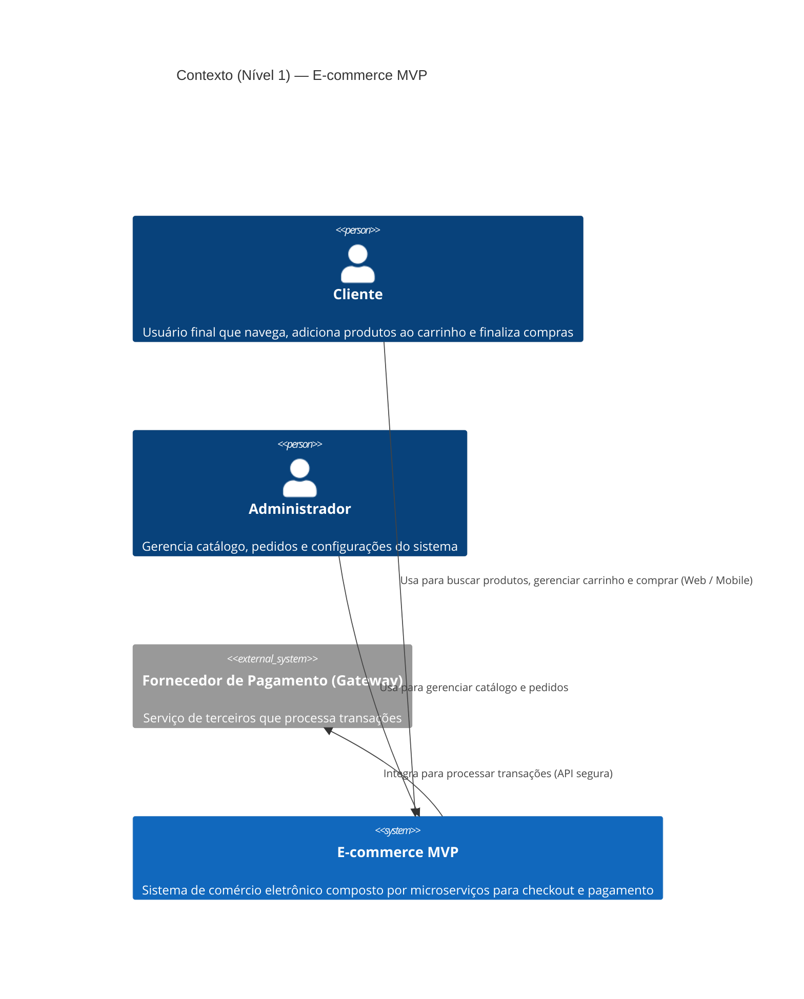
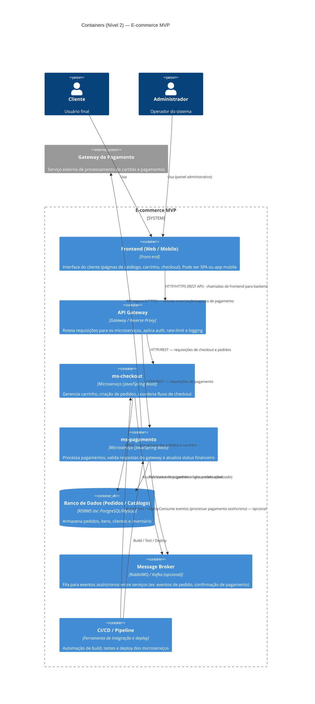

# E-commerce MVP — Diagrams arquiteturais (Mermaid)

Este repositório contém os diagramas arquiteturais (C4 — Nível 1 e Nível 2) do projeto E-commerce MVP no formato Mermaid.

Arquivos incluídos:

- `docs/diagrams/c4-context.mmd` — Contexto (Nível 1)
- `docs/diagrams/c4-container.mmd` — Containers (Nível 2)

---

Diagrama (Contexto) — arquivo: `docs/diagrams/c4-context.mmd`

Diagrama (Containers) — arquivo: `docs/diagrams/c4-container.mmd`

