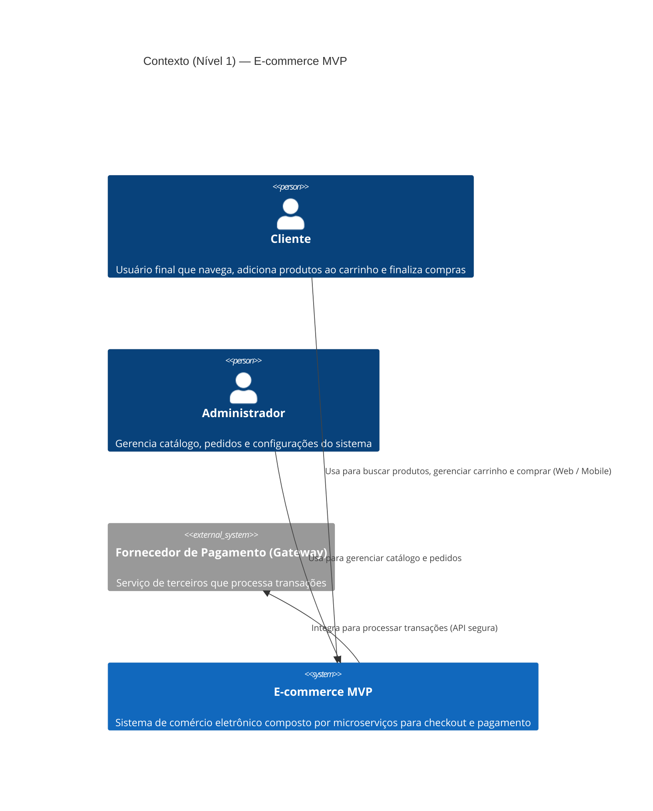
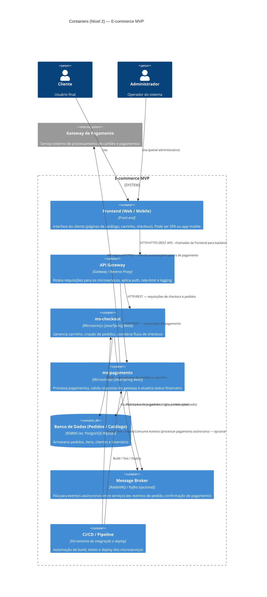

# E-commerce MVP — Arquitetura de Software

## 📋 Visão Geral

Projeto de MVP de e-commerce desenvolvido com **arquitetura em microserviços**, implementando design patterns e princípios de projeto sólidos.

---

## 🏗️ Arquitetura C4 Model

### Nível 1 — Contexto



**Atores principais:**
- **Cliente**: Navega, adiciona ao carrinho e finaliza compras
- **Administrador**: Gerencia catálogo e acompanha pedidos
- **Sistema Central**: Orquestra microserviços
- **Gateway Externo**: Processa pagamentos com segurança

---

### Nível 2 — Containers



**Componentes principais:**

| Componente | Tipo | Responsabilidade |
|-----------|------|------------------|
| **Frontend** | Web/Mobile | Interface com usuário |
| **API Gateway** | Gateway | Orquestra requisições, segurança, logging |
| **ms-checkout** | Microserviço | Carrinho, criação de pedidos |
| **ms-pagamento** | Microserviço | Processamento de pagamentos |
| **Database** | Armazenamento | Pedidos, clientes, inventário |
| **Message Broker** | Comunicação | Eventos assíncronos |
| **CI/CD** | DevOps | Deploy automatizado |

---

## 🎯 Princípios de Projeto

### Alta Coesão
Cada microserviço tem uma **única razão para mudar**:
- **ms-checkout**: Mudanças no fluxo de checkout
- **ms-pagamento**: Mudanças no processamento de pagamentos

### Baixo Acoplamento
Serviços **independentes e desacoplados**:
- Comunicação via APIs REST e eventos assíncronos
- Não compartilham código ou banco de dados
- Falha em um não afeta o outro

### Responsabilidades Bem Definidas
Cada container tem **uma única responsabilidade clara**:
- Sem ambiguidades
- Sem sobreposição de funcionalidades
- Fácil de testar e manter

---

## 🎯 Design Patterns Implementados

### 1️⃣ Strategy Pattern

**Propósito**: Define uma família de algoritmos intercambiáveis

**Aplicação**: Diferentes formas de pagamento
- Cartão de crédito
- PIX
- Expansível para outros métodos

**Benefício**: Adicione um novo tipo de pagamento sem alterar o código existente

**Localização**: 
- Interface: `ms-checkout/src/main/java/com/ecommerce/ms_checkout/patterns/strategy/PaymentStrategy.java`
- Implementações: `CardStrategy.java`, `PixStrategy.java`

---

### 2️⃣ Factory Pattern

**Propósito**: Cria objetos sem expor a lógica de criação

**Aplicação**: Instantiação da estratégia de pagamento correta
- Recebe tipo de pagamento como entrada
- Retorna a estratégia correspondente

**Benefício**: Desacoplamento total entre criação e uso

**Localização**: `ms-checkout/src/main/java/com/ecommerce/ms_checkout/patterns/factory/PaymentFactory.java`

---

### 3️⃣ Template Method Pattern

**Propósito**: Define a estrutura de um algoritmo, deixando detalhes para subclasses

**Aplicação**: Fluxo de checkout
1. Autenticação do cliente
2. Processamento de pagamento
3. Atualização do status do pedido
4. Envio de comprovante

**Benefício**: Reutilizável, previsível e fácil de testar

**Localização**: 
- Base: `ms-checkout/src/main/java/com/ecommerce/ms_checkout/patterns/template/CheckoutTemplate.java`
- Implementação: `CheckoutProcessor.java`

---

## 🔄 Justificativa da Arquitetura

### Por que Microserviços?

1. **Escalabilidade Independente**: Escale apenas o serviço que precisa
2. **Manutenibilidade**: Unidades menores e focadas
3. **Responsabilidade Bem Definida**: Cada serviço faz uma coisa bem
4. **Tolerância a Falhas**: Falha em um não para o sistema
5. **Comprovado no Mercado**: Amazon, Netflix, Uber utilizam

---

## 📁 Estrutura do Projeto

```
.
├── docs/
│   ├── Diagramas/          # Diagramas C4
│   └── ADR's/              # Architecture Decision Records
├── ms-checkout/            # Microserviço de checkout
│   └── src/main/java/com/ecommerce/ms_checkout/patterns/
│       ├── strategy/       # Strategy Pattern
│       ├── factory/        # Factory Pattern
│       └── template/       # Template Method Pattern
├── ms-pagamento/           # Microserviço de pagamentos
└── README.md               # Este arquivo
```

---

## 👥 Equipe e Contribuições

- **Edson** - Arquitetura C4 e Contexto
- **Luis** - Microserviço ms-checkout
- **Você** - Microserviço ms-pagamento
- **Roberth** - Architecture Decision Records (ADRs)
